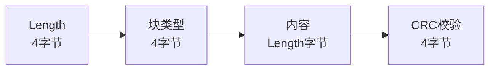
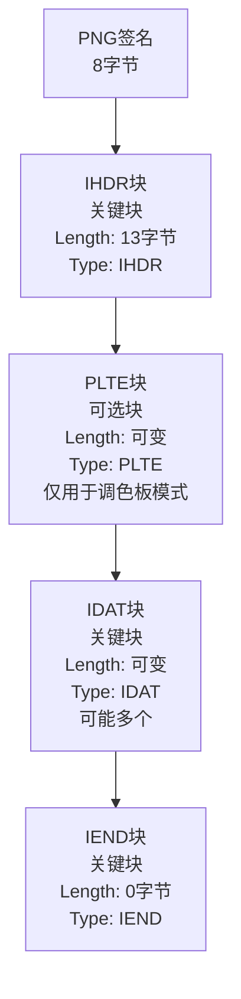

# 对png结构剖析以及相关攻击汇总

# png结构

一切都从0开始，先说明下常见的png图片的结构

## png文件签名 (Signature)

png文件以固定的8字节签名开头，用于标识文件类型：

```text
89 50 4E 47 0D 0A 1A 0A
```


emm，见多png图片结构的话，就很快发现这是png的文件头了，然后进行后续操作，比方说zip的明文攻击等等

## 数据块 (Chunks)

png文件由多个数据块组成，每个数据块包含特定类型的信息。数据块是png的核心结构，可以被分作这几个部分

- 长度(Length)：4字节，指定数据段的字节数（不包括长度、类型和CRC）。

- 块类型(Chunk Type): 4字节ASCII码，标识数据块的功能（如`IHDR`、`IDAT`等）

- 数据 (Chunk Data): 长度指定的数据内容，可能是图像元数据、像素数据等。

- CRC校验(CRC)：4字节，循环冗余校验码，确保数据块完整性。(请注意，crc计算范围只有块类型和数据，其他两个部分不要算入)

数据块分为**关键块**（必须有）和**辅助块**（可选）。常见数据块如下：

### 关键块

#### IHDR(文件头数据块)

是数据块的起点，每个正常的png图片有且只有一个IHDR块。它会定义图像的基本信息：

- 宽度（4字节）

- 高度（4字节）

- 位深度（1字节，如1、2、4、8、16）

- 颜色类型（1字节，定义颜色模式：0=灰度，2=RGB，3=索引颜色，4=灰度+Alpha,6=RGB+Alpha)

- 压缩方法（1字节，通常为0，表示deflate)

- 滤波方法（1字节，通常为0）

- 隔行扫描方法（1字节，0=非隔行，1=Adam7隔行）         ~~tips:总感觉这里有出题的新点，通过渲染不同行的类型，让一张照片有不同的样子~~

这里可以总结下

IHDR数据块的固定长度：IHDR的数据段总是13字节（宽度4+高度4+位深度1+颜色类型1+压缩方式1+滤波方式+隔行扫描方法1）

字节序：所有多字节字段（如宽度、高度）使用**大端序**

做个小解释

```text
89 50 4E 47 0D 0A 1A 0A 00 00 00 0D 49 48 44 52 00 00 05 DA 00 00 08 8D 08 02 00 00 00 1C 4C 11 E6
```

这里先看前8个字节，就是我前面说的png文件签名，然后按照顺序就来到了数据块，我说过，数据块应该被分作4各部分，其中是长度4+块类型4+数据（字节数不一定，得看块的类型，但是字节大小一定和前面长度一致）+CRC校验4

那这就很好看了，去掉文件签名后，剩下这些`00 00 00 0D 49 48 44 52 00 00 05 DA 00 00 08 8D 08 02 00 00 00 1C 4C 11 E6`先看4字节的长度00 00 00 0D我前面说过，这里是用大端序存储的，把16进制转换成10进制，就是13，哈哈，猜到这是什么数据块了吧，没错就是IHDR，这一点你可以将那个49 48 44 52进行ASCII解码就能看到，然后是数据段，00 00 05 DA转换10进制就是1498像素，然后00 00 08 8D转换后是2189像素，位深度是08，意味着8位，这是个常见值，然后颜色类型02表示的是RGB模式，压缩方式00表示的是deflate压缩，滤波方式00表示标准自适应滤波，隔行扫描方法00表示非隔行扫描（逐行渲染）。分析完数据块后，来到了CRC校验，1C 4C 11 E6，这个可以校验IHDR类型和数据段的计算结果是否匹配，大致理解成md5校验还是可以的吧，上面的内容，我们可以用010查看，这样的话就能很直观的分析，处理数据了


这里我们可以计算下CRC，验证下

```python
import zlib

ihdr=bytes.fromhex("49 48 44 52 00 00 05 DA 00 00 08 8D 08 02 00 00 00")
crc=zlib.crc32(ihdr)&0xFFFFFFFF #这里是确保CRC是无符号32位整数，这样才能与PNG文件的格式一致
print(f"计算的CRC:{hex(crc)}")

#计算的CRC:0x1c4c11e6
```

校验成功，好了，上述内容是单独对一个块的分析处理，其他的块大同小异，我后面就会稍微简略的带过了

#### IDAT（图像数据块）

通常会在辅助块PLTE（如果有的话）之后，而且一张png照片中可能会有多个idat块，它们会解码时按照顺序进行拼接

里面的内容是压缩后的图像像素数据，使用的是deflate算法，作用则是存储实际的图像数据（也就是说图片里的内容和这个idat块有关

做做了解好了
这里需要探讨下idat块的大小限制，通过脚本，可以实现任意大小的idat块的实现，通过ai的解释，目前常见的idat块最大是65536字节，它是由于zlib的默认缓冲区通常是64KB而限制的，当字节数达到65536的时候，为了适应缓冲区，我们就直接打包成一个idat块，然而对于不同的平台，或编译器，甚至人为，能产生不同版本的idat块。这是因为idat块只有唯一种压缩算法（deflate)，最后出现在显示屏上的是所有idat块按照顺序拼接得到的结果，这也就可以解释为什么有的idat块明明没有达到自身最大的idat块的时候直接打包，进入下一个idat块的编写的时候，文件依然可以正常打开查看

这里打包有个特点，就和我前面说的png数据块的结构那样长度4+块类型4+数据块（大小不一定，但与长度的值一致）+CRC4

而这也就意味着，只要所有的idat块满足这个结构就算合法，并没有所谓的大小限制（理论上大小其实由length决定，因为它只有4个字节，最大也就只能达到2^31-1字节，也就是2GB的大小，不然的话，我们的png结构会报错的

这里有个脚本，允许我们生成自定义idat块大小的png图片

```python
import png  # 需要安装 pypng: pip install pypng
import zlib
import struct
import random
import sys

def generate_image_data(width, height, image_type='gradient'):
    """
    生成图像数据，控制数据量以生成适量IDAT块。

    参数:
        width, height: 图像尺寸
        image_type: 'random'（随机像素）, 'gradient'（渐变）, 'solid'（单色）

    返回:
        图像数据（RGB格式，列表形式）
    """
    image_data = []
    if image_type == 'random':
        for _ in range(height):
            row = [random.randint(0, 255) for _ in range(width * 3)]
            image_data.append(row)
    elif image_type == 'gradient':
        for y in range(height):
            row = []
            for x in range(width):
                r = (x * 255 // width) % 256
                g = (y * 255 // height) % 256
                b = ((x + y) * 255 // (width + height)) % 256
                row.extend([r, g, b])
            image_data.append(row)
    else:  # solid
        row = [255, 0, 0] * width  # 红色
        image_data = [row[:] for _ in range(height)]
    return image_data

def write_custom_png(filename, width, height, idat_chunk_limit=16000, image_type='gradient'):
    """
    生成PNG图片，严格控制IDAT块大小。

    参数:
        filename: 输出PNG文件名
        width, height: 图像宽高
        idat_chunk_limit: 每个IDAT块的最大数据大小（字节）
        image_type: 图像类型
    """
    # 生成图像数据
    image_data = generate_image_data(width, height, image_type)

    # 创建PNG写入器（不依赖chunk_limit）
    writer = png.Writer(
        width=width,
        height=height,
        greyscale=False,
        alpha=False,
        bitdepth=8,
        compression=0  # 无压缩，增加数据量，确保多块
    )

    # 获取压缩数据
    filter_type = 0  # 无滤波，简化处理
    raw_data = bytearray()
    for row in image_data:
        raw_data.append(filter_type)
        raw_data.extend(row)
    compressed_data = zlib.compress(raw_data, level=0)

    # 手动分割压缩数据为IDAT块
    with open(filename, 'wb') as f:
        # 写入PNG签名
        f.write(b'\x89PNG\r\n\x1a\n')

        # 写入IHDR
        ihdr_data = struct.pack(
            '>IIBBBBB',
            width, height, 8, 2, 0, 0, 0  # RGB, 无压缩，标准滤波，非隔行
        )
        write_chunk(f, b'IHDR', ihdr_data)

        # 写入IDAT块
        offset = 0
        idat_count = 0
        while offset < len(compressed_data):
            chunk_size = min(idat_chunk_limit, len(compressed_data) - offset)
            chunk_data = compressed_data[offset:offset + chunk_size]
            write_chunk(f, b'IDAT', chunk_data)
            idat_count += 1
            offset += chunk_size

        # 写入IEND
        write_chunk(f, b'IEND', b'')

    print(f"PNG文件已生成: {filename}")
    print(f"图像尺寸: {width}x{height}, 图像类型: {image_type}, IDAT块大小上限: {idat_chunk_limit}字节")

def write_chunk(file, chunk_type, data):
    """
    写入PNG数据块（长度 + 类型 + 数据 + CRC）。
    """
    file.write(struct.pack('>I', len(data)))
    file.write(chunk_type)
    file.write(data)
    crc = zlib.crc32(chunk_type + data)
    file.write(struct.pack('>I', crc))

def verify_idat_chunks(filename, expected_chunk_limit):
    """
    验证PNG文件中IDAT块的大小和数量。

    参数:
        filename: PNG文件名
        expected_chunk_limit: 期望的IDAT块大小上限
    """
    print(f"\n验证文件: {filename}")
    try:
        with open(filename, 'rb') as f:
            # 检查PNG签名
            signature = f.read(8)
            if signature != b'\x89PNG\r\n\x1a\n':
                print("错误: 不是有效的PNG文件")
                return

            idat_count = 0
            total_idat_size = 0
            chunk_sizes = []

            # 读取数据块
            while True:
                chunk_length_bytes = f.read(4)
                if not chunk_length_bytes:
                    break
                chunk_length = struct.unpack('>I', chunk_length_bytes)[0]
                chunk_type = f.read(4)

                if chunk_type == b'IDAT':
                    idat_count += 1
                    chunk_sizes.append(chunk_length)
                    total_idat_size += chunk_length

                f.seek(chunk_length, 1)  # 跳过数据
                f.seek(4, 1)  # 跳过CRC

            # 验证结果
            print(f"总计IDAT块数: {idat_count}")
            print(f"总IDAT数据大小: {total_idat_size}字节")
            for i, size in enumerate(chunk_sizes, 1):
                status = "符合预期"
                if size > expected_chunk_limit:
                    status = f"超出预期（{size - expected_chunk_limit}字节）"
                elif i < idat_count and size < expected_chunk_limit * 0.95:
                    status = "小于预期（可能数据不足）"
                elif i == idat_count and size < expected_chunk_limit:
                    status = "正常（最后一个块）"
                print(f"IDAT块 {i}: {size}字节 ({status})")

    except Exception as e:
        print(f"验证失败: {e}")

if __name__ == "__main__":
    # 配置参数
    output_file = "strict_idat.png"
    image_width = 1000
    image_height = 1000
    idat_size_limit = 70000
    image_type = 'gradient'  # 渐变图像，适中数据量

    # 生成和验证
    write_custom_png(
        filename=output_file,
        width=image_width,
        height=image_height,
        idat_chunk_limit=idat_size_limit,
        image_type=image_type
    )
    verify_idat_chunks(output_file, idat_size_limit)
```

这里稍微普及下DEFLATE算法，这个知识点在zip压缩中也会被用到，它结合了Huffman编码和LZ77算法，通过这两个主要步骤实现高效压缩：

- LZ77算法：用于查找和替换重复的数据序列（字符串），以减少冗余。

- Huffman编码：对数据中的符号（字节或匹配标记）进行变长编码，常见符号分配较短的编码，稀有符号分配较长的编码，从而进一步压缩数据

在将图像数据传递给DEFLATE算法**之前**，PNG会对每一行像素数据应用过滤器。过滤的目的是减少相邻像素之间的数值差异，使数据更适合压缩。png定义了5种过滤类型（0到4）：

- 类型0：无过滤：直接使用原始像素值。

- 类型1：Sub:当前像数值减去前一个像素值

- 类型2：Up:当前像素值减去上一行对应位置的像素值。

- 类型3：Average:当前像素值减去前一个像素和上一行像素的平均值。

- 类型4：Paeth:使用Paeth预测器，基于前一个像素、上一行像素和左上角像素进行预测

这里进行预处理的原因是过滤后的数据通常具有较小一点的变化波动以及更多的重复模式，这使得后面的DEFLATE压缩能更加高效。（tips:每行数据的第一个字节会记录使用的过滤器类型，解码时会根据此信息还原原始像素值）


具体的deflate压缩步骤还是有点复杂，涉及lz77算法和huffman树，暂时没有研究透，我后面会在zip专栏中记录它们的原理

#### IEND(文件尾数据块)

这是关键块的最后一部分

```textile
00 00 00 00 49 45 4E 44 AE 42 60 82
```

就和png文件签名那样，这里的文件尾数据块也是特定的，细剖下，00 00 00 00代表着数据块的内容为空，49 45 4E 44转换成ASCII后就是IEND，接下来直接到CRC校验部分AE 42 60 82


### 辅助块

> 这里的辅助块有点小多，而且涉及到的考点，目前我是没有接触过，所以我选择快速说明种类和功能

#### PLTE(Palatte)

- 作用：定义调色板（索引颜色模式）的颜色表

- 内容：每三字节表示一个颜色（RGB），最多256个颜色（768字节）

- 出现位置：在IDAT块之前。

- 必须性：仅当颜色类型为3（调色板模式）时必须存在；对于其他颜色类型（如RGB、灰度）是可选的或禁止的

tips:
调色板模式就是我在IHDR中写到的类型3：索引模式

----

还有其他13个真·辅助块

- 图像显示：tRNS,bKGD,sRGB,pHYs

- 颜色管理：cHRM,gAMA,iCCP,sRGB,sBIT

- 元数据：tEXt,zTXt,iTXt,tIME

- 调色板优化：hIST,sPLT

我这里不打算一一列举，给推荐两个官方文章，上面有相关介绍

[Portable Network Graphics (PNG) Specification (Third Edition)](https://www.w3.org/TR/png/)

上面的是官方给出的说明，可能理解上有点点困难

这是[libpng](http://www.libpng.org/pub/png/spec/1.2/PNG-Chunks.html)提供的手册，可能会更好理解一点

## summary

数据块结构



基本的png结构



# png攻击汇总（其实偏隐写了

这里呢，我会记录一些ctf中常见的png考点，会断断续续进行更新

> png攻击真的好多，很丰富，这里我会针对png格式特有的攻击技巧进行记录整理

## 文件插入字符信息

这里玩的也挺花，首先一种是直接暴力添加，将一串字符，甚至flag直接拼接到png图片的IEND块后面，这是被允许的，因为编译器在识别png图片的时候，会严格从PNG文件签名开始，然后到IEND块结束，后面的字符串，它们不会理会，也就不会报错了，这也算是送分题或放hint了

其他的方法就是利用png辅助块隐藏信息，常见的可以隐藏文本的辅助块如下：

- tEXt块：存储未压缩的文本数据，通常用于元信息（如作者、描述）。数据内容的格式是`[关键字]\0[文本内容]`

- zTXt块：存储压缩的文本数据（使用zlib压缩） 数据内容的格式：`[关键字]\0[压缩标志]\0[压缩数据]`，压缩标志通常为0

- iTXt块：支持国际化文本（UTF-8编码），可以存储压缩或未压缩数据。 数据内容的格式：`[关键字]\0[压缩标志]\0[压缩方式]\0[语言标签]\0[翻译关键字]\0[文本]`

- 最后还有种自定义辅助块，首先满足基本块的结构，里面存放数据即可，（块类型为小写字母开头）解析器会忽略不认识的块

能考查到的这一部分知识点就这些了吧

推荐几个工具，首先是010 editor，最厉害的十六进制编辑器，通过这个可以直接用‘瞪眼’法（大佬一定可以，我还不行

然后推荐使用TweakPNG工具，它可以帮助我们将图片里的所有数据块整理出来，后续在其他攻击中还能用它直接敲除或提取多余，特殊的IDAT块

接下来再推荐个工具exiftool，它可以帮我们快速将png的元信息提取出来

> 这里yolo想学习自己写个妙妙工具，就在这里立个flag吧，后期我会把仓库链接补充到文章下面的

在对py的认真学习，以及在ai的帮助下，终于完成这个小脚本

```python
import struct
from collections import Counter
import zlib

def check_png(file_path):
    correct_header = bytes([0x89, 0x50, 0x4E, 0x47, 0x0D, 0x0A, 0x1A, 0x0A])
    try:
        with open(file_path, 'rb') as file:
            header = file.read(8)
            if len(header) != 8:
                return False, f"文件{file_path}太短，不是有效的PNG文件"
            if header != correct_header:
                return False, f"这文件不是png啊，这是正确的{correct_header}, 而你的这个文件是这个{header}"
            return True, f"文件{file_path}是一个有效的PNG文件"
    except FileNotFoundError:
        return False, f"文件{file_path}不存在"
    except Exception as e:
        return False, f"发生了一个错误: {e}"

def count_png_chunks(file_path):
 
    is_valid, message = check_png(file_path)
    if not is_valid:
        return 0, [], [], message

    chunk_count = 0
    chunk_types = []
    text_chunks = []
  
    text_chunk_types = {'zTXt', 'iTXt', 'tEXt'}
    
    try:
        with open(file_path, 'rb') as file:
   
            file.seek(8)
            
            while True:
     
                length_bytes = file.read(4)
                if len(length_bytes) != 4:
                    break  
                length = struct.unpack('>I', length_bytes)[0]
                
          
                type_bytes = file.read(4)
                if len(type_bytes) != 4:
                    return 0, [], [], f"文件{file_path}在读取块类型时出错"
                chunk_type = type_bytes.decode('ascii', errors='ignore')
                
        
                is_auxiliary = (len(chunk_type) == 4 and chunk_type[0].islower() and 
                              chunk_type[3].isupper())
                
                if chunk_type in text_chunk_types or is_auxiliary:
                    data = file.read(length)
                    try:
                        if chunk_type == 'zTXt':
                          
                            null_index = data.find(b'\0')
                            if null_index != -1:
                                keyword = data[:null_index].decode('ascii', errors='ignore')
                                compressed_data = data[null_index + 2:]  
                                try:
                                    content = zlib.decompress(compressed_data).decode('utf-8', errors='ignore')
                                    text_chunks.append(f"发现了zTXt块，关键字：{keyword}，内容：{content}")
                                except zlib.error:
                                    text_chunks.append(f"发现了zTXt块，关键字：{keyword}，内容：无法解压缩")
                        elif chunk_type == 'iTXt':
                            
                            null_index = data.find(b'\0')
                            if null_index != -1:
                                keyword = data[:null_index].decode('ascii', errors='ignore')
                                content = data[null_index + 5:].decode('utf-8', errors='ignore')  
                                text_chunks.append(f"发现了iTXt块，关键字：{keyword}，内容：{content}")
                        elif chunk_type == 'tEXt':
                          
                            null_index = data.find(b'\0')
                            if null_index != -1:
                                keyword = data[:null_index].decode('ascii', errors='ignore')
                                content = data[null_index + 1:].decode('ascii', errors='ignore')
                                text_chunks.append(f"发现了tEXt块，关键字：{keyword}，内容：{content}")
                        elif is_auxiliary:
                           
                            try:
                           
                                null_index = data.find(b'\0')
                                if null_index != -1:
                                    keyword = data[:null_index].decode('ascii', errors='ignore')
                                    content = data[null_index + 1:].decode('utf-8', errors='ignore')
                                    text_chunks.append(f"发现了自定义辅助块 {chunk_type}，关键字：{keyword}，内容：{content}")
                                else:
                                    
                                    content = data.decode('utf-8', errors='ignore')
                                    text_chunks.append(f"发现了自定义辅助块 {chunk_type}，内容：{content}")
                            except Exception as e:
                                text_chunks.append(f"解析自定义辅助块 {chunk_type} 时出错: {e}")
                    except Exception as e:
                        text_chunks.append(f"解析{chunk_type}块时出错: {e}")
                else:
            
                    file.seek(length, 1)
                
       
                crc_bytes = file.read(4)
                if len(crc_bytes) != 4:
                    return 0, [], [], f"文件{file_path}在读取CRC时出错"
                
             
                chunk_count += 1
                chunk_types.append(chunk_type)
                
             
                if chunk_type == 'IEND':
      
                    remaining_data = file.read()
                    if remaining_data:
                        try:
                      
                            content = remaining_data.decode('utf-8', errors='ignore')
                            if content.strip(): 
                                text_chunks.append(f"发现了IEND块后的额外内容，内容：{content}")
                        except Exception as e:
                            text_chunks.append(f"解析IEND块后内容时出错: {e}")
                    break  
                
    except Exception as e:
        return 0, [], [], f"解析{file_path}时发生错误: {e}"
    
    
    type_counts = Counter(chunk_types)
    type_summary = [f"{chunk_type}: {count} 次" for chunk_type, count in type_counts.items()]
    
    return chunk_count, type_summary, text_chunks, f"文件{file_path}包含 {chunk_count} 个数据块"

if __name__ == "__main__":
    import argparse
    parser = argparse.ArgumentParser(description="检查PNG文件并统计其数据块")
    parser.add_argument("-f", "--files", nargs='+', required=True, help="指定要检查的PNG文件路径")
    args = parser.parse_args()

    for file_path in args.files:
     
        result, message = check_png(file_path)
        print(message)
        
        if result:
  
            count, types, text_chunks, summary = count_png_chunks(file_path)
            print(summary)
            if count > 0:
                print("数据块类型统计:")
                for type_info in types:
                    print(f"  {type_info}")
                if text_chunks:
                    print("\n文本块、自定义辅助块及IEND后内容:")
                    for text_info in text_chunks:
                        print(f"  {text_info}")
```


使用方法是 `python3 png_extract.py -f xxx.png`

这里给分享个我用来生成测试png的脚本

```python
import struct
import zlib
import argparse
from datetime import datetime

def calculate_crc(data):
    """计算 CRC32 校验值"""
    return zlib.crc32(data) & 0xffffffff

def create_png_chunk(chunk_type, data):
    """创建 PNG 数据块，包括长度、类型、数据和 CRC"""
    length = len(data)
    chunk_type_bytes = chunk_type.encode('ascii')
    chunk_data = chunk_type_bytes + data
    crc = calculate_crc(chunk_data)
    
    return (
        struct.pack('>I', length) +  
        chunk_data +                
        struct.pack('>I', crc)      
    )

def create_ihdr(width, height, bit_depth=8, color_type=2):
    """创建 IHDR 块（图像头部）"""
    ihdr_data = struct.pack(
        '>IIBBBBB',
        width,          
        height,         
        bit_depth,      
        color_type,    
        0,              
        0,              
        0               
    )
    return create_png_chunk('IHDR', ihdr_data)

def create_idat(width, height):
    """创建 IDAT 块（图像数据，简单示例使用纯色填充）"""
    
    scanline = b'\x00' + (b'\xFF\x00\x00' * width)  
    image_data = scanline * height
    compressed_data = zlib.compress(image_data)
    return create_png_chunk('IDAT', compressed_data)

def create_text_chunk(chunk_type, keyword, text):
    """创建文本块（tEXt, zTXt, iTXt）"""
    if chunk_type == 'tEXt':
        data = keyword.encode('ascii') + b'\x00' + text.encode('ascii')
    elif chunk_type == 'zTXt':
        compressed_text = zlib.compress(text.encode('utf-8'))
        data = keyword.encode('ascii') + b'\x00\x00' + compressed_text
    elif chunk_type == 'iTXt':
        data = (keyword.encode('ascii') + b'\x00' +  
                b'\x00\x00' +                       
                b'\x00\x00' +                       
                text.encode('utf-8'))               
    else:
        raise ValueError(f"不支持的文本块类型: {chunk_type}")
    return create_png_chunk(chunk_type, data)

def generate_png(filename, width=100, height=100, text_chunks=None):
    """生成 PNG 文件，并可插入指定的文本块"""
    
    png_signature = bytes([0x89, 0x50, 0x4E, 0x47, 0x0D, 0x0A, 0x1A, 0x0A])
    
    
    chunks = [
        create_ihdr(width, height), 
        create_idat(width, height),  
    ]
    
  
    if text_chunks:
        for chunk_type, keyword, text in text_chunks:
            if chunk_type in ['tEXt', 'zTXt', 'iTXt']:
                chunks.insert(1, create_text_chunk(chunk_type, keyword, text))
    
  
    chunks.append(create_png_chunk('IEND', b''))
    
   
    try:
        with open(filename, 'wb') as f:
            f.write(png_signature)
            for chunk in chunks:
                f.write(chunk)
        return True, f"成功生成 PNG 文件: {filename}"
    except Exception as e:
        return False, f"生成 PNG 文件时出错: {e}"

if __name__ == "__main__":
    parser = argparse.ArgumentParser(description="生成 PNG 文件并插入文本块")
    parser.add_argument("-o", "--output", default=f"output_{datetime.now().strftime('%Y%m%d_%H%M%S')}.png",
                       help="输出 PNG 文件名")
    parser.add_argument("-W", "--width", type=int, default=100, help="图像宽度")
    parser.add_argument("-H", "--height", type=int, default=100, help="图像高度")
    parser.add_argument("-t", "--text", nargs=3, action='append',
                       metavar=('CHUNK_TYPE', 'KEYWORD', 'TEXT'),
                       help="添加文本块，格式：类型(tEXt/zTXt/iTXt) 关键字 文本内容")
    
    args = parser.parse_args()
    
 
    text_chunks = []
    if args.text:
        for chunk_type, keyword, text in args.text:
            if chunk_type not in ['tEXt', 'zTXt', 'iTXt']:
                print(f"错误：不支持的文本块类型 {chunk_type}")
                exit(1)
            text_chunks.append((chunk_type, keyword, text))
    

    success, message = generate_png(args.output, args.width, args.height, text_chunks)
    print(message)
```

各位大佬简单看看我的脚本就清楚怎么使用了吧，这是我随便弄的一个测试例子

```
python3 createpng.py -o image_with_texts.png -W 300 -H 200 -t tEXt Author "Bob" -t zTXt Comment "This is a test image" -t iTXt
```

## 结构缺失、混乱


请看，上面的结构有够乱的吧，接下来就需要我们手动调整，将图片提取出来，当看到两个IHDR，我们就可以确定，这个大杂烩是两张图片放到一起了，结合我们前面说的png结构知识点，可以进行组合将两个照片分离出来（附件来源：XYCTF2025-喜欢就说出来


```python
import struct
import argparse

def check_png(file_path):
    """检查文件是否为有效的 PNG 文件"""
    correct_header = bytes([0x89, 0x50, 0x4E, 0x47, 0x0D, 0x0A, 0x1A, 0x0A])
    try:
        with open(file_path, 'rb') as file:
            header = file.read(8)
            if len(header) != 8:
                return False, f"文件{file_path}太短，不是有效的PNG文件"
            if header != correct_header:
                return False, f"文件{file_path}不是PNG文件，预期头{correct_header}，实际头{header}"
            return True, f"文件{file_path}是一个有效的PNG文件"
    except FileNotFoundError:
        return False, f"文件{file_path}不存在"
    except Exception as e:
        return False, f"发生错误: {e}"

def list_png_chunks(file_path):
    """逐个检测并输出 PNG 文件的数据块信息"""
    
    is_valid, message = check_png(file_path)
    if not is_valid:
        print(message)
        return

    print(message)
    print("数据块列表:")
    print("  序号  类型  大小（字节）")

    try:
        with open(file_path, 'rb') as file:
        
            file.seek(8)
            
            chunk_index = 0
            while True:
            
                length_bytes = file.read(4)
                if len(length_bytes) != 4:
                    if length_bytes:  
                        print(f"错误：第{chunk_index}个块长度数据不完整")
                    break  
                length = struct.unpack('>I', length_bytes)[0]
                
               
                type_bytes = file.read(4)
                if len(type_bytes) != 4:
                    print(f"错误：第{chunk_index}个块类型数据不完整")
                    break
                chunk_type = type_bytes.decode('ascii', errors='ignore')
                
          
                file.seek(length, 1)
                
               
                crc_bytes = file.read(4)
                if len(crc_bytes) != 4:
                    print(f"错误：第{chunk_index}个块CRC数据不完整")
                    break
                
            
                print(f"  {chunk_index:>4}  {chunk_type:<4}  {length:>12}")
                
                chunk_index += 1
                
             
                if chunk_type == 'IEND':
                    break
                
    except Exception as e:
        print(f"错误：解析{file_path}时发生异常: {e}")

if __name__ == "__main__":
    parser = argparse.ArgumentParser(description="逐个列出PNG文件的数据块")
    parser.add_argument("-f", "--files", nargs='+', required=True, help="指定要检查的PNG文件路径")
    args = parser.parse_args()

    for file_path in args.files:
        list_png_chunks(file_path)

# 脚本使用方法：python3 chunks_check.py xxx.png
```

这个脚本功能就是说把一个png图片的所有数据块罗列出来，本质上和pngdebugger工具的作用相同，然后解题的时候建议自己根据脚本输出结果进行分析，如果能锁定哪些数据块异常的话，那就还是使用tweakpng工具进行手动敲除吧，我也想过写一个脚本灵活处理不同数据块，但是经过几套脚本的测试，在我看来始终不如tweakpng好用，就不在这里显摆我的垃圾脚本了吧


## IDAT块隐写

这里考察了idat的压缩特质，（唯一一种deflate压缩模式），然后和我前面讨论的那个idat大小限制有关，一般来说图片的idat块会从第一个idat块到倒数第二个idat块的大小是一致的，因为这是同一个编译器处理的png图片，自然它们底层设计的规则也是一样的，而最后一个idat块大小比前面的小，是因为图片数据已经写完了，所以没有填满编译器限制的idat的最大阈值。出题师傅考察这种知识点时，会给选手留一点点线索，最直接的便是在图片数据块最后再加个idat块，这个时候，我们用Tweakpng打开图片的时候，发现在连续的idat块中出现了不规则的一个（这里得排除连续idat块后面的第一个块，大概率是没有问题滴

感觉有个新的知识考点，如果说我把两个文件的idat块放到一起，常见的idat隐写是把最后一个idat块导出，我这次呢，就选择让两个图片的idat最大值一致，然后解题选手需要根据中间不一样的地方，分开两张照片即可


这个知识点的脚本我觉得没有必要单独准备，就用我上面的那个chunks_check.py进行分析，然后拿tweakpng工具进行处理即可

## CRC宽高爆破

这里的知识点很简单，出题人把ihdr块的宽高手动改了，但是他不会改动crc校验值的（不排除一些超级逆天题目），然后我们可以进行宽高爆破，爆破难度不大的，正常来说png图片的宽高不会过大，我们爆破的难度其实并不大，脚本稍后我会补上


```python
import zlib
import struct
import argparse
import itertools
from pathlib import Path

def check_png(bin_data, file_path):
    """检查 PNG 文件头和 IHDR 块完整性"""
    correct_header = bytes([0x89, 0x50, 0x4E, 0x47, 0x0D, 0x0A, 0x1A, 0x0A])
    if len(bin_data) < 33:
        return False, f"文件{file_path}太短，不是有效的PNG文件"
    if bin_data[:8] != correct_header:
        return False, f"文件{file_path}不是PNG文件，预期头{correct_header}，实际头{bin_data[:8]}"
    length = struct.unpack('>I', bin_data[8:12])[0]
    chunk_type = bin_data[12:16].decode('ascii', errors='ignore')
    if length != 13 or chunk_type != 'IHDR':
        return False, f"文件{file_path}的IHDR块无效，长度应为13，类型应为IHDR，实际长度{length}，类型{chunk_type}"
    return True, f"文件{file_path}是一个有效的PNG文件"

def repair_png(file_path, bin_data, width, height):
    """生成修复后的 PNG 文件"""
    output_path = str(Path(file_path).with_stem(Path(file_path).stem + '_fixed'))
    try:
        new_data = (
            bin_data[:16] +
            struct.pack('>I', width) +
            struct.pack('>I', height) +
            bin_data[24:]
        )
        with open(output_path, 'wb') as f:
            f.write(new_data)
        return True, f"修复成功，保存为 {output_path}"
    except Exception as e:
        return False, f"保存修复文件失败: {e}"

def main():
    parser = argparse.ArgumentParser(description="通过CRC爆破PNG文件的IHDR宽高并修复")
    parser.add_argument("-f", type=str, default=None, required=True,
                        help="输入同级目录下图片的名称")
    args = parser.parse_args()

    try:
        bin_data = open(args.f, 'rb').read()
    except FileNotFoundError:
        print(f"文件{args.f}不存在")
        return

 
    is_valid, message = check_png(bin_data, args.f)
    print(message)
    if not is_valid:
        return


    ihdr_data = bin_data[12:29]
    original_crc32 = struct.unpack('>I', bin_data[29:33])[0]
    crc32key = zlib.crc32(ihdr_data)
    width, height = struct.unpack('>II', bin_data[16:24])

    print(f"原始宽度: {width}, hex: {hex(width)}")
    print(f"原始高度: {height}, hex: {hex(height)}")
    print(f"CRC 校验: {'通过' if crc32key == original_crc32 else '失败'}")

    if crc32key == original_crc32:
        print("宽高没有问题!")
        return

  
    input_ = input("宽高被改了，是否CRC爆破宽高? (Y/n): ")
    if input_.lower() not in ["y", ""]:
        print("退出爆破")
        return

    common_resolutions = [
        (300, 200), (1920, 1080), (1280, 720), (1024, 768), (800, 600),
        (2560, 1440), (3840, 2160), (512, 512), (640, 480)
    ]

    print("\n开始 CRC 宽高爆破：")
   
    for i, j in common_resolutions:
        data = (
            bin_data[12:16] +
            struct.pack('>I', i) +
            struct.pack('>I', j) +
            bin_data[24:29]
        )
        crc32 = zlib.crc32(data)
        if crc32 == original_crc32:
            print(f"\n找到匹配的宽高！")
            print(f"CRC32: {hex(original_crc32)}")
            print(f"宽度: {i}, hex: {hex(i)}")
            print(f"高度: {j}, hex: {hex(j)}")
            
           
            success, repair_message = repair_png(args.f, bin_data, i, j)
            print(repair_message)
            return

 
    print("常见分辨率未找到匹配，尝试穷举 1 到 4095...")
    for i, j in itertools.product(range(1, 4096), range(1, 4096)):
        data = (
            bin_data[12:16] +
            struct.pack('>I', i) +
            struct.pack('>I', j) +
            bin_data[24:29]
        )
        crc32 = zlib.crc32(data)
        if crc32 == original_crc32:
            print(f"\n找到匹配的宽高！")
            print(f"CRC32: {hex(original_crc32)}")
            print(f"宽度: {i}, hex: {hex(i)}")
            print(f"高度: {j}, hex: {hex(j)}")
            
            
            success, repair_message = repair_png(args.f, bin_data, i, j)
            print(repair_message)
            return

    print("\n爆破失败，未找到匹配CRC的宽高")

if __name__ == "__main__":
    main() 
```

脚本使用方法：`python3 crc_weigh_high.py -f xxx.png`

脚本原理就和我前面说过的结构那样，然后这里重点是爆破，因为图片的宽高显然不会过大，理由是ctf比赛中，很难看到有特别大的分辨率的图片，然后我为了能加快爆破速度，在这里设置了几个常见的分辨率组合


## 颜色通道隐写

这里也是很重要的考点，由于png的无损压缩的特性，而且存储像素是用RGB,RGBA等，这种利用颜色通道就能做很多事情了，这里先说LSB，核心思想如下：

- 每个像素的每个通道（如R,G,B)用8位表示，值为0到255

- 修改最低位（第0位）只会使像素值变化±1，这个变化很微小，人眼几乎无法察觉

- 通过这种方式，我们可以将文件，字符串等秘密信息诸位嵌入到像素通道的最低位，达到隐藏信息的目的

这里推荐的工具是stegsolve,zsteg，它们可以帮助我们分析不同颜色通道的内容，从而达到解密的目的

还有种常见的，是msb隐写，它和LSB相对应，修改的是最高位

但是后来打了几场比赛，发现有些赛题是不会单纯考我们lsb,msb，他们可能会随机组合颜色通道，这个时候，我们就不好处理了，不清楚应该怎么组合去提取隐藏信息

我的处理思路是写个爆破脚本，然后再记录个常见信息的字典，它会遍历组合所有可能的颜色通道，如果发现出现字典上的信息，会将当前组合返回，接下来我们就着重分析那个通道下的隐藏信息就好了


先在这里分享一下，在任意通道下插入文本或文件的脚本，请注意，插入文本或文件会受到图片大小限制，原因很简单，图片大小就首先限制了我们可以改动的像素点数量，然后为了不让图片变化太大，一般建议我们采用lsb隐写，通过最低位隐写会使得我们较难分辨出原图和加密图片的区别，但这也会进一步限制通道隐写插入隐写信息的像素数量

```python
from PIL import Image
import numpy as np

def binary_to_bits(data):
    """
    将字节数据转换为二进制字符串
    """
    return ''.join(format(byte, '08b') for byte in data)

def insert_lsb_hidden_data(image_path, output_path, data, channel_bit_pairs, is_file=False):
    """
    将数据（文本或文件）插入PNG图片的指定通道和位
    """
    try:
        img = Image.open(image_path)
        if img.mode != 'RGB':
            img = img.convert('RGB')
    except Exception as e:
        print(f"错误: 无法打开图片 {image_path}: {str(e)}")
        return
    
    pixels = np.array(img, dtype=np.uint8)
    height, width, _ = pixels.shape
    
    
    if is_file:
        bits = binary_to_bits(data)
        print(f"文件大小: {len(data)} 字节 ({len(bits)} 位)")
    else:
        try:
            if data.startswith('b"') and data.endswith('"'):
                bytes_data = eval(data)
            else:
                bytes_data = data.encode('latin1')
            bits = binary_to_bits(bytes_data)
            print(f"消息长度: {len(bytes_data)} 字节 ({len(bits)} 位)")
        except Exception as e:
            print(f"错误: 无法解析文本消息: {str(e)}")
            return
    
    
    max_bits = height * width * len(channel_bit_pairs)
    if len(bits) > max_bits:
        print(f"错误: 数据太长（{len(bits)} 位），图片容量 {max_bits} 位")
        return
    
    print(f"图片容量: {max_bits} 位，通道/位组合: {channel_bit_pairs}")
    
    
    bit_index = 0
    for i in range(height):
        for j in range(width):
            pixel = pixels[i, j].copy().astype(np.uint8)
            for channel, bit in channel_bit_pairs:
                if bit_index >= len(bits):
                    break
                value = pixel[channel]
                
                pixel[channel] = np.uint8((value & (255 ^ (1 << bit))) | (int(bits[bit_index]) << bit))
                bit_index += 1
            pixels[i, j] = pixel
            if bit_index >= len(bits):
                break
        if bit_index >= len(bits):
            break
    
    
    try:
        Image.fromarray(pixels).save(output_path)
        print(f"已生成包含隐藏信息的图片: {output_path}")
    except Exception as e:
        print(f"错误: 保存图片失败: {str(e)}")

def main():
  
    image_path = input("请输入原始PNG图片路径: ")
    output_path = input("请输入输出PNG图片路径（包含隐藏信息）: ")
    input_type = input("输入类型（text/file）: ").lower()
    
    try:
        if input_type == 'file':
            file_path = input("请输入要隐藏的文件路径（例如 secret.zip）: ")
            with open(file_path, 'rb') as f:
                data = f.read()
            is_file = True
        else:
            data = input("请输入要隐藏的消息（例如 flag{test} 或 b\"PK\\x03\\x04\"）: ")
            is_file = False
        
        combo_input = input("请输入通道和位组合（格式：通道索引,位索引，例如 '0,0 2,1'，留空默认 '0,0 1,1 2,2'）: ")
        channel_bit_pairs = [(0,0), (1,1), (2,2)] if not combo_input.strip() else [tuple(map(int, pair.split(','))) for pair in combo_input.split()]
        
        for channel, bit in channel_bit_pairs:
            if channel not in [0, 1, 2] or bit not in range(8):
                print(f"错误: 无效的通道或位索引: ({channel},{bit})")
                return
        
        insert_lsb_hidden_data(image_path, output_path, data, channel_bit_pairs, is_file)
    except FileNotFoundError:
        print(f"错误: 文件未找到，请检查路径")
    except ValueError as e:
        print(f"错误: 无效输入: {str(e)}")
    except Exception as e:
        print(f"错误: {str(e)}")

if __name__ == "__main__":
    main() Exception as e:
        print(f"错误: {str(e)}")

if __name__ == "__main__":
    main()
```


终端差不多是这样的

```bash
yolo@Yolo:~/Desktop$ /usr/bin/python3 /home/yolo/Desktop/png_lsb_insert.py
请输入原始PNG图片路径: image_with_texts.png
请输入输出PNG图片路径（包含隐藏信息）: image_plus2.png
输入类型（text/file）: file
请输入要隐藏的文件路径（例如 secret.zip）: extracted_message.zip
请输入通道和位组合（格式：通道索引,位索引，例如 '0,0 2,1'，留空默认 '0,0 1,1 2,2'）: 
文件大小: 198 字节 (1584 位)
图片容量: 180000 位，通道/位组合: [(0, 0), (1, 1), (2, 2)]
已生成包含隐藏信息的图片: image_plus2.pngeg.png
```

这里我可以说明下，我用stegsolve查看过lsb，发现隐藏信息就在插入信息时设置的通道中
这是直接放文本的


这是直接放文件的


接下来，我的爆破通道提取脚本

```python
from PIL import Image
import numpy as np
import itertools
import re

def load_markers(dict_file):
    """
    从字典文件加载标志列表，支持正则表达式
    """
    try:
        with open(dict_file, 'r', encoding='utf-8') as f:
            markers = [line.strip() for line in f if line.strip()]
        
        regex_markers = []
        string_markers = []
        for marker in markers:
            if marker.startswith('r"') and marker.endswith('"'):
                try:
                  
                    pattern = marker[2:-1]
                    regex_markers.append(re.compile(pattern, re.IGNORECASE))
                except re.error as e:
                    print(f"无效正则表达式 {marker}: {str(e)}")
            else:
                string_markers.append(marker)
        return string_markers, regex_markers
    except Exception as e:
        print(f"无法读取字典文件 {dict_file}: {str(e)}")
        return ['flag'], []

def extract_message_from_combination(pixels, height, width, channel_bit_pairs, string_markers, regex_markers, binary_mode=False):
    """
    从指定的通道和位组合中提取隐藏信息，支持正则表达式
    """
    if not channel_bit_pairs:
        return None, channel_bit_pairs
    
    binary_message = ""
    max_bits = 1024 if binary_mode else 1024 * 8  
    for i in range(height):
        for j in range(width):
            pixel = pixels[i, j]
            if len(pixel) != 3:
                return None, channel_bit_pairs
            
            for channel, bit in channel_bit_pairs:
                if channel not in [0, 1, 2] or bit not in range(8):
                    return None, channel_bit_pairs
                value = pixel[channel]
                binary_message += str((value >> bit) & 1)
                
                if len(binary_message) >= max_bits:
                    break
            
            if not binary_mode and len(binary_message) >= 8:
                byte = binary_message[-8:]
                try:
                    char = chr(int(byte, 2))
                    if char == '\0':
                        binary_message = binary_message[:-8]
                        break
                except ValueError:
                    continue
        if not binary_mode and len(binary_message) >= 8 and char == '\0':
            break
        if len(binary_message) >= max_bits:
            break
    
    if binary_mode:
        
        temp_message = ""
        for i in range(0, len(binary_message), 8):
            byte = binary_message[i:i+8]
            if len(byte) == 8:
                try:
                    temp_message += chr(int(byte, 2))
                except ValueError:
                    break
        for marker in string_markers:
            if marker.lower() in temp_message.lower():
                return binary_message, channel_bit_pairs
        for regex in regex_markers:
            if regex.search(temp_message):
                return binary_message, channel_bit_pairs
        return None, channel_bit_pairs
    
    message = ""
    for i in range(0, len(binary_message), 8):
        byte = binary_message[i:i+8]
        if len(byte) == 8:
            try:
                message += chr(int(byte, 2))
            except ValueError:
                break
    
    for marker in string_markers:
        if marker.lower() in message.lower():
            return message, channel_bit_pairs
    for regex in regex_markers:
        if regex.search(message):
            return message, channel_bit_pairs
    return None, channel_bit_pairs

def extract_lsb_message(image_path, dict_file="markers.txt", output_file="extracted_message.txt", binary_output="extracted_binary.bin"):
    
    try:
        img = Image.open(image_path)
        if img.mode != 'RGB':
            img = img.convert('RGB')
    except Exception as e:
        print(f"错误: 无法打开图片 {image_path}: {str(e)}")
        return None, None
    
 
    try:
        pixels = np.array(img, dtype=np.uint8)
        height, width, _ = pixels.shape
        print(f"图片尺寸: {width}x{height}")
    except Exception as e:
        print(f"错误: 无法加载像素数据: {str(e)}")
        return None, None
    
   
    string_markers, regex_markers = load_markers(dict_file)
    print(f"已加载标志: {string_markers + [m.pattern for m in regex_markers]}")
    
    
    channels = [0, 1, 2]
    bits = list(range(8))  
    
   
    print("开始提取，请等待...")
    for r in range(1, 4):
        for channel_combo in itertools.permutations(channels, r):
            for bit_combo in itertools.product(bits, repeat=len(channel_combo)):
                channel_bit_pairs = [(channel_combo[i], bit_combo[i]) for i in range(len(channel_combo))]
                
             
                message, combo = extract_message_from_combination(pixels, height, width, channel_bit_pairs, string_markers, regex_markers, binary_mode=False)
                if message:
                    try:
                        with open(output_file, 'w', encoding='utf-8') as f:
                            f.write(message)
                        print(f"找到包含标志的文本消息！使用的通道和位组合: {combo}")
                        print(f"文本消息已保存到 {output_file}")
                        return message, combo
                    except Exception as e:
                        print(f"错误: 保存文本消息出错: {str(e)}")
                
               
                binary_message, combo = extract_message_from_combination(pixels, height, width, channel_bit_pairs, string_markers, regex_markers, binary_mode=True)
                if binary_message:
                    try:
                        binary_bytes = bytes(int(binary_message[i:i+8], 2) for i in range(0, len(binary_message) - len(binary_message) % 8, 8))
                        with open(binary_output, 'wb') as f:
                            f.write(binary_bytes)
                        print(f"找到包含标志的二进制数据！使用的通道和位组合: {combo}")
                        print(f"二进制数据已保存到 {binary_output}")
                        return binary_message, combo
                    except Exception as e:
                        print(f"错误: 保存二进制数据出错: {str(e)}")
    
    print("未找到包含任何标志的消息")
    return None, None

def main():
  
    image_path = input("请输入包含隐藏信息的PNG图片路径: ")
    dict_file = input("请输入标志字典文件路径（默认 'markers.txt'）: ") or "markers.txt"
    
    try:
        result, combo = extract_lsb_message(image_path, dict_file)
        if result:
            if isinstance(result, str):
                print("提取的内容预览:", result[:100], "..." if len(result) > 100 else "")
            else:
                print("提取的内容预览:", result[:100], "..." if len(result) > 100 else "")
            print(f"使用的通道和位组合: {combo}")
        else:
            print("提取失败，请检查图片或字典文件")
    except Exception as e:
        print(f"错误: {str(e)}")

if __name__ == "__main__":
    main()
```

使用的时候需要弄个标志字典，给看官举个例子

```textile
flag
f14g
r"PK\x03\x04"
r"PK\x01\x02"
r"PK\x05\x06"
r"flag\{.*\}"
r"nctf\{.*\}"
```

然后这是我的终端运行提取脚本的案例

```bash
yolo@Yolo:~/Desktop$ /usr/bin/python3 /home/yolo/Desktop/lsb_extracted.py
请输入包含隐藏信息的PNG图片路径: image_plus2.png
请输入标志字典文件路径（默认 'markers.txt'）: dict.txt
图片尺寸: 300x200
已加载标志: ['flag', 'f14g', 'PK\\x03\\x04', 'PK\\x01\\x02', 'PK\\x05\\x06', 'flag\\{.*\\}', 'nctf\\{.*\\}']
开始提取，请等待...
找到包含标志的文本消息！使用的通道和位组合: [(0, 0), (1, 1), (2, 2)]
文本消息已保存到 extracted_message.txt
提取的内容预览: PK 
使用的通道和位组合: [(0, 0), (1, 1), (2, 2)]
```

我这里的通道组合是按照RGB走的，每个颜色分别有0~7，各8个bit

这样的爆破速度还是蛮快的

---


相关的脚本我就这样写了吧，在我看来，还是有一些优化部分，比如说把上面的脚本能汇总到一个大的妙妙软件中就好了，不过我现在开发能力还有点差劲，只能在这里留个坑了，等我后面对开发掌握更加深入后，我会把那个集成后的工具链接发到这里的

# 尾声

这里应该还有个频域攻击、盲水印的知识点没有写到，它们涉及到傅里叶变换、离散余弦变换等好多知识点，还有，它对图片的格式限制较为宽松，所以我后面会单开一篇文章记录这个知识点
